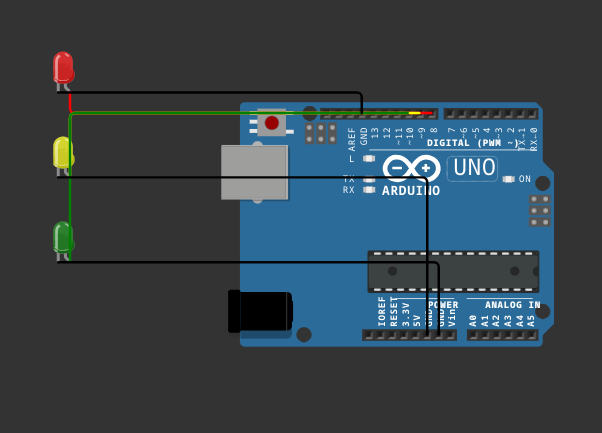

# This was built at a hackathon in 5 hours, It's just a Proof of concept

## Hardware Dad — Wokwi Circuit Builder CLI

PS: You can actually run code on these arduinos! They are being simulated by wokwi.

### Demo

<details>
<summary>Show Demo</summary>

- **Prompt**: I want to make a traffic light in arduino, add and connect 3 leds RED, GREEN, YELLOW to an arduino



</details>


A simple CLI that uses Anthropic (via LangChain) to build Arduino circuits and export a Wokwi-compatible `diagram.json`.

### Prerequisites
- Python 3.x
- An Anthropic API key

### 1) Install required Python modules
```bash
pip install -r requirements.txt
```

### 2) Export your Anthropic API key
- macOS/Linux (bash/zsh):
```bash
export ANTHROPIC_API_KEY="your_api_key_here"
```

- Windows PowerShell:
```powershell
$env:ANTHROPIC_API_KEY="your_api_key_here"
```

Alternatively, create a `.env` file in the project root:
```
ANTHROPIC_API_KEY=your_api_key_here
```

### 3) Run the CLI
- Interactive mode:
```bash
python CLI.py
```

- Demo (auto-builds an Arduino + LED example and generates `diagram.json`):
```bash
python CLI.py --demo
```

Notes:
- The file name is case-sensitive. Use `CLI.py` (not `cli.py`).
- When a task includes generating the diagram, the tool will write `diagram.json` to the project root.

### 4) Simulate your JSON in Wokwi
You have two options:

- In VS Code using the Wokwi extension: open the project folder containing `diagram.json` and start the simulator.
- Or copy/paste the contents of `diagram.json` into a new project at the Wokwi web simulator: [New Arduino Uno project on Wokwi](https://wokwi.com/projects/new/arduino-uno).

The CLI’s "Generate diagram" step writes a Wokwi-compatible `diagram.json`, so you can simulate it right away in either environment.

